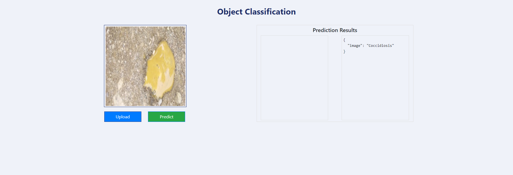
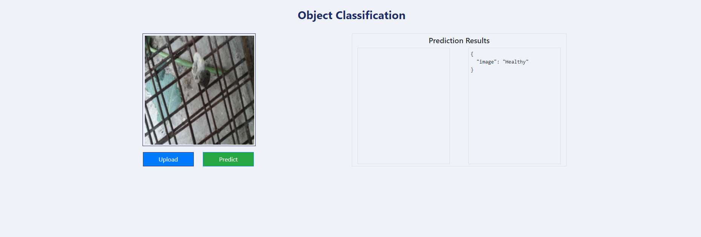

# Chicken-Disease-Classification--Project

## Problem Statement

To detect diseases in chickens at an early stage using deep learning techniques,
preventing mortality in chickens, farmers loss due to mortality among chickens and ultimately keeping us healthy too.
The aim of this project is
to develop a very intelligent system for the early identification of various diseases in chickens.
VGG16 from Keras Applications was implemented for the categorical classification of "Coccidiosis" and "Healthy." 

## Demo 

<div>
    
    
</div>

## Workflows

1. Update config.yaml
2. Update secrets.yaml [Optional]
3. Update params.yaml
4. Update the entity
5. Update the configuration manager in src config
6. Update the components
7. Update the pipeline 
8. Update the main.py
9. Update the dvc.yaml


# How to run?
### STEPS:

Clone the repository

```bash
https://github.com/entbappy/Chicken-Disease-Classification--Project
```
### STEP 01- Create a conda environment after opening the repository

```bash
conda create -n cnncls python=3.8 -y
```

```bash
conda activate cnncls
```

### STEP 02- install the requirements
```bash
pip install -r requirements.txt
```


```bash
# Finally run the following command
python app.py
```

Now,
```bash
open up you local host and port
```

### STEP 03- Export the environment variables (Linux)

```bash
export PYTHONPATH=$PYTHONPATH:/path/to/Chicken-Disease-Classification
export AWS_ACCESS_KEY_ID=<AWS_ACCESS_KEY_ID>
export AWS_SECRET_ACCESS_KEY=<AWS_SECRET_ACCESS_KEY>
```

### STEP 04- Run the application server

```bash
python app.py
```

### STEP 05- Train application

```bash
http://localhost:80/train
```

### STEP 06- Prediction application

```bash
http://localhost:80/predict
```

### DVC cmd

1. dvc init
2. dvc repro
3. dvc dag


# AZURE-CICD-Deployment-with-Github-Actions

## Save pass:

s3cEZKH5yytiVnJ3h+eI3qhhzf9q1vNwEi6+q+WGdd+ACRCZ7JD6


## Run from terminal:

docker build -t chickenapp.azurecr.io/chicken:latest .

docker login chickenapp.azurecr.io

docker push chickenapp.azurecr.io/chicken:latest


## Deployment Steps:

1. Build the Docker image of the Source Code
2. Push the Docker image to Container Registry
3. Launch the Web App Server in Azure 
4. Pull the Docker image from the container registry to Web App server and run 
